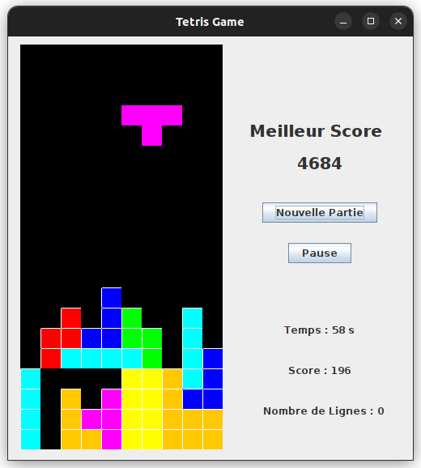

# Java Tetris


## But du jeu
Avoir le score le plus élevé possible !

## Actions
les flèches
- `droite` : se déplace à droite
- `gauche` : se déplace à gauche
- `bas` : la pièce se place directement

les touches
- `Q` : tourne dans le sens horaire
- `D` : tourne dans le sens anti-horaire
- `P` : mise en pause du jeu
- `entrée` : nouvelle partie

## Calcul du score
- Augmente de 1 à chaque ligne dépassée par la pièce
- Augmente de 40, 100, 300 ou 1200 points en fonction du nombre de lignes remplies en même temps

## Installation / Compilation
- cloner ce dépôt git
- lancer les commandes suivantes dans le terminal
 ```
 javac VueControleur/VC.java
 java VueControleur.VC
 ```
*Attention* : Se placer dans le dossier `src/src`

## Credits
- [PAULUS Noëllie](https://forge.univ-lyon1.fr/p2100318)
- [RATOANDROMANAN Miella](https://forge.univ-lyon1.fr/p2108878)

Projet réalisé dans le cadre de l'UE Programmation Orientée Objet (L3)
Université Claude Bernard Lyon 1
